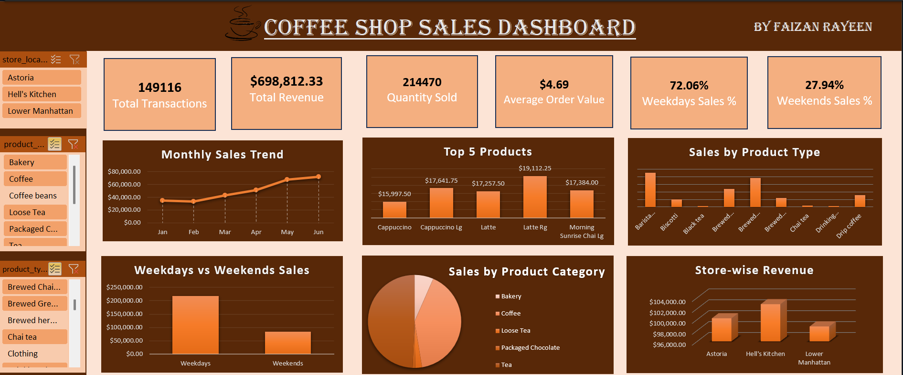

# ☕ Coffee Shop Sales Dashboard

An Excel dashboard analyzing sales performance across coffee shop store locations, products, and time periods — built to uncover sales trends and top-performing products/stores.

## 📊 Overview

This dashboard breaks down transactions, revenue, and product performance using Pivot Tables and Slicers, filterable by **Store Location**, **Product Category**, and **Product Type**.

## 🔑 Key Metrics (KPIs)

| Metric | Value |
|---|---|
| Total Transactions | 149,116 |
| Total Revenue | $698,812.33 |
| Quantity Sold | 214,470 |
| Average Order Value | $4.69 |
| Weekdays Sales % | 72.06% |
| Weekends Sales % | 27.94% |

## 📈 Dashboard Components

- **Monthly Sales Trend** – line chart tracking revenue growth from January to June
- **Top 5 Products** – bar chart of best-selling products by revenue (Cappuccino, Latte, etc.)
- **Sales by Product Type** – comparison across all product types
- **Weekdays vs Weekends Sales** – bar chart comparing revenue split
- **Sales by Product Category** – pie chart across Bakery, Coffee, Loose Tea, Packaged Chocolate, and Tea
- **Store-wise Revenue** – 3D bar chart comparing revenue across Astoria, Hell's Kitchen, and Lower Manhattan
- **Interactive Filters** – Store Location, Product Category, Product Type

## 💡 Key Insights

- Sales show a strong upward trend from January to June.
- Weekday sales significantly outperform weekend sales (72% vs 28%).
- Latte and Cappuccino variants dominate the top-selling products list.
- Hell's Kitchen store generates the highest revenue among the three locations.

## ✅ Recommendations

- Leverage the strong weekday performance with targeted weekday promotions.
- Investigate ways to boost weekend footfall through weekend-specific offers.
- Focus inventory and marketing on top-performing products (Latte, Cappuccino).

## 🛠️ Tools Used

- Microsoft Excel (Pivot Tables, Pivot Charts, Slicers, Dashboard Design)

## 📂 Files

- `Coffee_Shop_Sales_Dashboard.xlsx` – full interactive workbook
- `dashboard_preview.png` – dashboard screenshot

## 👤 Author

**Faizan Rayeen**
