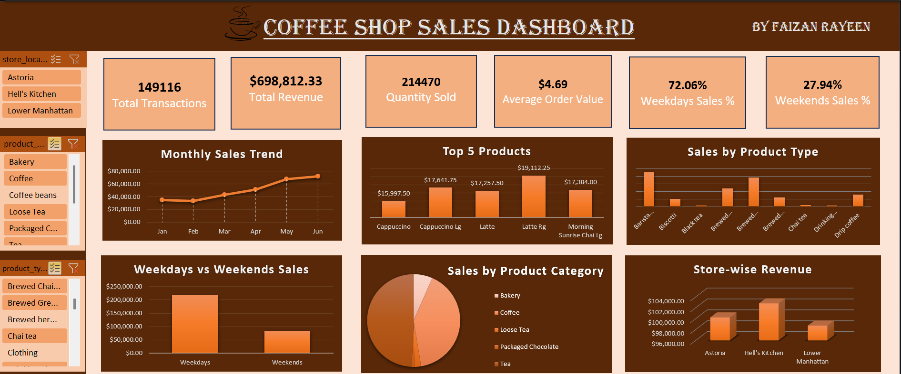

# ☕ Coffee Shop Sales Dashboard (Microsoft Excel)

An interactive Microsoft Excel sales dashboard analyzing revenue performance, transaction volumes, and product demand across multiple store locations to identify key revenue drivers and optimize store operations.

---

## 📊 Business Problem & Overview

Managing multi-location retail coffee shops requires real-time insights into store-level footfall, peak sales windows, top-selling beverage items, and weekday vs. weekend performance.

### Core Objectives:
* 💰 Track overall revenue growth and transaction volume trends across H1 (Jan–Jun).
* 🏪 Evaluate revenue differences across store locations (**Astoria, Hell's Kitchen, Lower Manhattan**).
* ☕ Pinpoint top-performing product categories (Coffee, Tea, Bakery, Chocolate).
* 📅 Analyze sales distribution across Weekdays vs. Weekends.

---

## 🔑 Key Performance Indicators (KPIs)

| Metric | Value | Business Significance |
|---|---|---|
| **Total Revenue** | **$698,812.33** | Gross sales generated across all 3 store locations |
| **Total Transactions** | **149,116** | Total customer orders processed |
| **Quantity Sold** | **214,470** | Total individual beverage and food items sold |
| **Average Order Value (AOV)** | **$4.69** | Average basket size per transaction |
| **Weekday Sales Contribution** | **72.06%** | Primary revenue driver window |
| **Weekend Sales Contribution** | **27.94%** | Secondary sales window |

---

## 📈 Key Dashboard Features

* **Monthly Revenue Trend**: Line chart illustrating strong, consistent month-over-month growth from January through June.
* **Top 5 Best-Selling Products**: Ranked bar chart highlighting top revenue generators (*Cappuccino, Latte, Gourmet Brewed Coffee*).
* **Category Revenue Split**: Donut breakdown across Coffee, Tea, Bakery, Loose Tea, and Packaged Chocolate.
* **Location Breakdown**: 3D comparative chart highlighting **Hell's Kitchen** as the top revenue location.
* **Interactive Slicers**: Dynamic filtering by Store Location, Product Category, and Product Type.

---

## 💡 Key Business Insights

1. **Weekday Dominance**: Over **72% of sales** occur between Monday and Friday, driven by morning commute coffee demand.
2. **Product Champions**: Espresso-based beverages (*Latte & Cappuccino*) generate over 45% of total beverage revenue.
3. **Location Performance**: **Hell's Kitchen** yields the highest average revenue per transaction, while Astoria shows steady growth.
4. **Growth Trajectory**: Revenue steadily increased every month from January ($81k) to June ($166k).

---

## ✅ Strategic Recommendations

* 🎯 **Weekday Promos**: Implement fast-checkout morning combos during weekday peak rush hours (7 AM – 10 AM).
* 🎁 **Weekend Loyalty Offers**: Launch weekend-only bundled discounts (e.g., Coffee + Bakery pastry) to boost weekend footfall.
* 📦 **Inventory Optimization**: Ensure high inventory levels of premium milk and espresso beans at the Hell's Kitchen location.

---

## 🛠️ Tools & Excel Functions Used

* **Pivot Tables & Pivot Charts** for dynamic data aggregation
* **Slicers & Timeline Controls** for interactive user experience
* **Excel Formulas**: `VLOOKUP`, `INDEX-MATCH`, `SUMIFS`, `COUNTIFS`, `AVERAGE`
* **Custom Formatting & Layout Design**

---

## 📂 File Structure

* `Coffee_Shop_Sales_Dashboard.xlsx` — Full interactive Excel workbook
* `dashboard_preview.png` — High-resolution dashboard screenshot
* `README.md` — Project documentation & business insights

---

## 👤 Author
**Mohd Faizan Rayeen**  
🌐 **[Live Portfolio](https://faizanrayeen.github.io/Portfolio)** | 💼 **[LinkedIn](https://www.linkedin.com/in/faizan-rayeen)** | 📧 **[Email](mailto:faizanrayeen675@gmail.com)**
