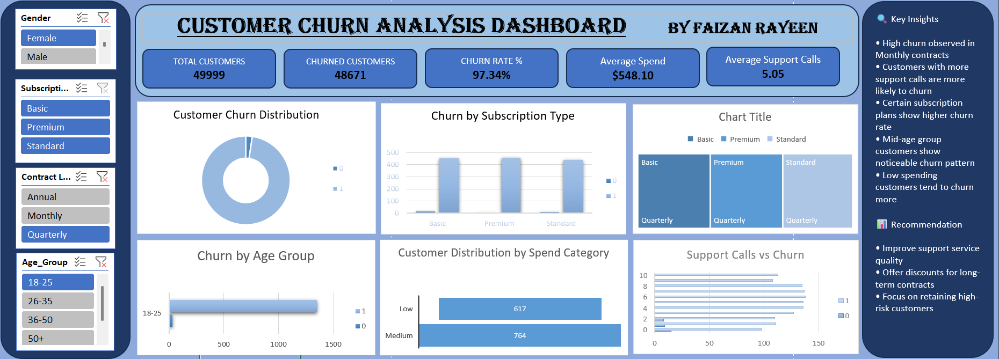

# 📉 Customer Churn Analysis Dashboard

An Excel dashboard built to analyze customer churn patterns, identify at-risk customer segments, and support retention strategy decisions.

## 📊 Overview

This dashboard uses Pivot Tables and Slicers to break down churn across **Gender**, **Subscription Type**, **Contract Length**, and **Age Group**, helping to pinpoint which customer segments are most likely to churn.

## 🔑 Key Metrics (KPIs)

| Metric | Value |
|---|---|
| Total Customers | 49,999 |
| Churned Customers | 48,671 |
| Churn Rate | 97.34% |
| Average Spend | $548.10 |
| Average Support Calls | 5.05 |

## 📈 Dashboard Components

- **Customer Churn Distribution** – donut chart of churned vs retained customers
- **Churn by Subscription Type** – bar chart comparing churn across Basic, Premium, and Standard plans
- **Churn by Contract Length** – comparison across Monthly, Quarterly, and Annual contracts
- **Churn by Age Group** – bar chart highlighting churn concentration by age
- **Customer Distribution by Spend Category** – Low vs Medium spend segments
- **Support Calls vs Churn** – relationship between number of support calls and churn likelihood
- **Interactive Filters** – Gender, Subscription Type, Contract Length, Age Group

## 💡 Key Insights

- High churn observed in customers on Monthly contracts.
- Customers with more support calls are more likely to churn.
- Certain subscription plans show higher churn rates than others.
- Mid-age group customers show a noticeable churn pattern.
- Low-spending customers tend to churn more.

## ✅ Recommendations

- Improve support service quality to reduce churn linked to high support call volume.
- Offer discounts or incentives for long-term (Annual) contracts to improve retention.
- Focus retention efforts on high-risk customer segments identified above.

## 🛠️ Tools Used

- Microsoft Excel (Pivot Tables, Pivot Charts, Slicers, Dashboard Design)

## 📂 Files

- `Customer_Churn_Analysis_Dashboard.xlsx` – full interactive workbook
- `dashboard_preview.png` – dashboard screenshot

## 👤 Author

**Faizan Rayeen**
