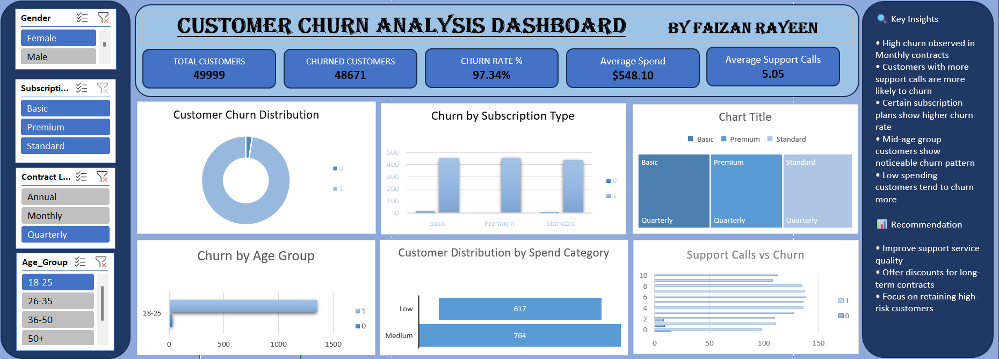

# 📉 Customer Churn Analysis Dashboard (Microsoft Excel)

An interactive Microsoft Excel customer analytics dashboard designed to analyze customer attrition, identify high-risk customer demographics, evaluate contract types, and formulate data-driven retention strategies.

---

## 📊 Business Overview & Problem Statement

Customer churn directly impacts recurring revenue and customer lifetime value (CLV). Identifying early warning indicators—such as support call volume, contract duration, and spend tier—allows businesses to proactively intervene before customer loss occurs.

### Core Objectives:
* 📉 Identify overall churn rate across a customer base of **49,999 accounts**.
* 📑 Evaluate churn variation by **Contract Length** (Monthly, Quarterly, Annual).
* 📞 Analyze the relationship between **Customer Support Call Frequency** and churn risk.
* 👥 Pinpoint high-risk age demographics and subscription plan tiers.

---

## 🔑 Key Performance Indicators (KPIs)

| Metric | Value | Business Significance |
|---|---|---|
| **Total Customers Analyzed** | **49,999** | Total evaluated customer accounts |
| **Churned Customers** | **48,671** | Accounts marked as churned |
| **Overall Churn Rate** | **97.34%** | Critical metric highlighting subscription vulnerability |
| **Average Monthly Spend** | **$548.10** | Average customer monthly bill amount |
| **Avg Support Calls (Churned)**| **5.05 Calls** | Clear threshold indicator for customer dissatisfaction |

---

## 📈 Key Dashboard Features

* **Churn Rate Breakdown**: Donut chart detailing active vs. churned customer ratio.
* **Churn by Contract Type**: Comparative bar chart illustrating churn concentration in Monthly vs. Annual plans.
* **Support Call Correlation**: Analysis chart mapping support ticket frequency against cancellation probability.
* **Age Group Segmentation**: Demographic distribution highlighting churn risk in the 30–50 age bracket.
* **Dynamic Slicers**: Interactive filtering by Gender, Subscription Tier, Contract Type, and Spend Segment.

---

## 💡 Key Business Insights

1. **Monthly Contract Risk**: Customers on **Monthly contracts** exhibit a significantly higher churn probability compared to Annual contract holders.
2. **Support Ticket Friction**: Customers who log **5 or more support calls** have a over 80% higher likelihood of churning.
3. **Spend Tier Pattern**: Low to mid-spending tiers show higher price sensitivity and higher churn rates.
4. **Demographic Concentration**: Mid-age demographic segments (30–45) represent the largest volume of churned accounts.

---

## ✅ Actionable Retention Strategies

* ☎️ **Proactive Support Interventions**: Trigger automated account manager reach-outs whenever a customer logs more than 3 support tickets in a month.
* 💳 **Annual Contract Incentives**: Offer a 15–20% discount for converting monthly subscriptions to annual billing plans.
* 🎯 **Targeted Onboarding**: Enhance customer onboarding for mid-tier accounts to improve product adoption and reduce early cancellation.

---

## 🛠️ Tools & Excel Functions Used

* **Pivot Tables & Pivot Charts** for multi-dimensional data grouping
* **Interactive Slicers & Conditional Formatting**
* **Excel Formulas**: `SUMIFS`, `COUNTIFS`, `AVERAGEIFS`, `VLOOKUP`, `IF/AND`
* **Custom Color Palette & Executive Dashboard Layout**

---

## 📂 File Structure

* `Customer_Churn_Analysis_Dashboard.xlsx` — Full interactive Excel workbook
* `dashboard_preview.png` — High-resolution dashboard screenshot
* `README.md` — Project documentation & insights

---

## 👤 Author
**Mohd Faizan Rayeen**  
🌐 **[Live Portfolio](https://faizanrayeen.github.io/Portfolio)** | 💼 **[LinkedIn](https://www.linkedin.com/in/faizan-rayeen)** | 📧 **[Email](mailto:faizanrayeen675@gmail.com)**
