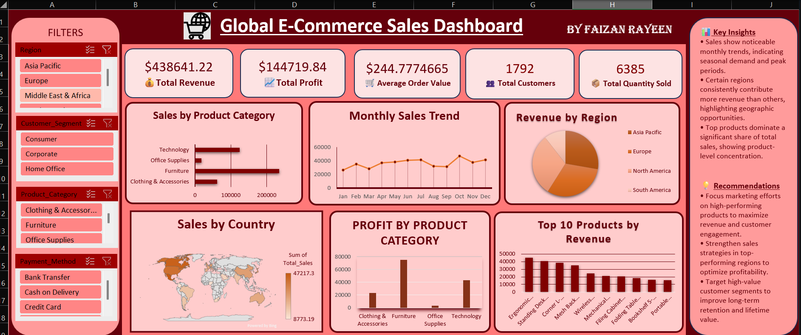

# 🌍 Global E-Commerce Sales Dashboard

An interactive Excel dashboard analyzing global e-commerce sales performance across regions, product categories, and countries — built to identify revenue drivers and support data-driven business decisions.

## 📊 Overview

This dashboard tracks key e-commerce metrics using Pivot Tables, Slicers, and dynamic charts, allowing users to filter data by **Region**, **Customer Segment**, **Product Category**, and **Payment Method**.

## 🔑 Key Metrics (KPIs)

| Metric | Value |
|---|---|
| Total Revenue | $438,641.22 |
| Total Profit | $144,719.84 |
| Average Order Value | $244.78 |
| Total Customers | 1,792 |
| Total Quantity Sold | 6,385 |

## 📈 Dashboard Components

- **Sales by Product Category** – horizontal bar chart comparing revenue across Technology, Furniture, Office Supplies, and Clothing & Accessories
- **Monthly Sales Trend** – line chart tracking sales seasonality across the year
- **Revenue by Region** – pie chart showing regional revenue contribution
- **Sales by Country** – geo map visualizing country-wise sales
- **Profit by Product Category** – bar chart comparing profitability across categories
- **Top 10 Products by Revenue** – ranked bar chart of best-selling products
- **Interactive Filters** – Region, Customer Segment, Product Category, Payment Method

## 💡 Key Insights

- Sales show noticeable monthly trends, indicating seasonal demand and peak periods.
- Certain regions consistently contribute more revenue than others, highlighting geographic opportunities.
- Top products dominate a significant share of total sales, showing product-level concentration.

## ✅ Recommendations

- Focus marketing efforts on high-performing products to maximize revenue and customer engagement.
- Strengthen sales strategies in top-performing regions to optimize profitability.
- Target high-value customer segments to improve long-term retention and lifetime value.

## 🛠️ Tools Used

- Microsoft Excel (Pivot Tables, Pivot Charts, Slicers, Dashboard Design)

## 📂 Files

- `Global_Ecommerce_Sales_Dashboard.xlsx` – full interactive workbook
- `dashboard_preview.png` – dashboard screenshot

## 👤 Author

**Faizan Rayeen**
