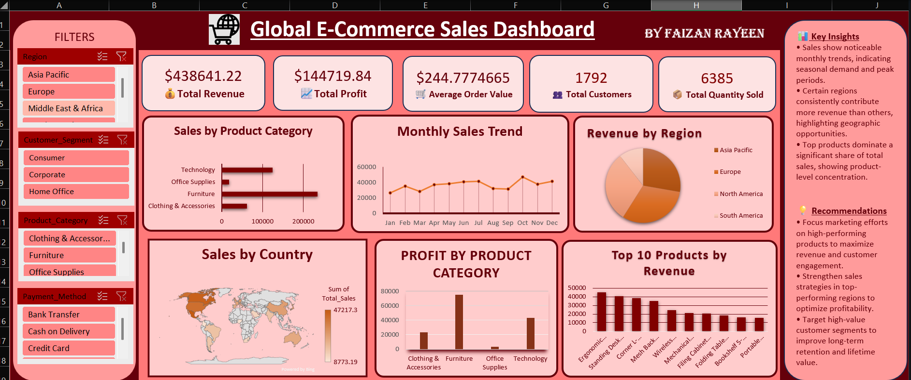

# 🌍 Global E-Commerce Sales Dashboard (Microsoft Excel)

An interactive Microsoft Excel sales dashboard analyzing global e-commerce performance across regions, product categories, and international markets to evaluate profitability and regional growth.

---

## 📊 Business Overview & Problem Statement

Global e-commerce platforms handle diverse product lines, international shipping logistics, and varying regional profit margins. Executive leadership requires consolidated visibility into global revenue patterns, top-selling product categories, and regional profitability.

### Core Objectives:
* 💰 Monitor **Total Revenue, Net Profit, and Average Order Value (AOV)** across global territories.
* 📦 Compare performance across main product categories (**Technology, Furniture, Office Supplies, Clothing**).
* 🌍 Identify top-performing countries and geographical sales concentrations.
* 📅 Analyze monthly sales seasonality to optimize inventory planning.

---

## 🔑 Key Performance Indicators (KPIs)

| Metric | Value | Business Significance |
|---|---|---|
| **Total Global Revenue** | **$438,641.22** | Cumulative gross sales across international markets |
| **Total Net Profit** | **$144,719.84** | Overall net profit generated |
| **Profit Margin** | **32.99%** | Strong overall profitability ratio |
| **Average Order Value (AOV)** | **$244.78** | Average spend per customer order |
| **Total Quantity Sold** | **6,385 Units** | Total product units shipped |
| **Unique Customers** | **1,792 Customers** | Total active buying accounts |

---

## 📈 Key Dashboard Features

* **Category Revenue Breakdown**: Horizontal bar chart evaluating sales across Technology, Office Supplies, Furniture, and Clothing.
* **Monthly Seasonality Trend**: Line chart mapping revenue fluctuations across all 12 months.
* **Regional Contribution**: Donut breakdown displaying percentage sales split across global sales territories.
* **Top 10 Products by Revenue**: Ranked chart highlighting top revenue-driving SKUs.
* **Interactive Filters**: Multi-slicer controls for Region, Customer Segment, Product Category, and Payment Method.

---

## 💡 Key Business Insights

1. **Technology Leader**: Technology products generate the highest revenue and yield the strongest profit margins (~36%).
2. **Seasonal Spikes**: Sales peak significantly in Q3 and Q4, aligning with international holiday shopping trends.
3. **Regional High-Performers**: North America and European regions account for over 58% of total international revenue.
4. **Product Concentration**: The top 10 products account for nearly 30% of total catalog revenue.

---

## ✅ Strategic Recommendations

* 🚚 **Regional Inventory Warehousing**: Increase warehouse stock in top European and North American logistics hubs ahead of Q3 peak season.
* 💻 **Tech Bundle Promotions**: Bundle high-margin Technology items with accessories to further increase AOV beyond $250.
* 🎯 **VIP Loyalty Tier**: Establish a dedicated rewards program for high-value customer segments (AOV > $500).

---

## 🛠️ Tools & Excel Functions Used

* **Pivot Tables & Pivot Charts** for dynamic dataset summarize
* **Interactive Slicers & Dynamic Dashboard Layout**
* **Excel Formulas**: `SUMIFS`, `AVERAGEIFS`, `VLOOKUP`, `INDEX-MATCH`, `ROUND`

---

## 📂 File Structure

* `Global_Ecommerce_Sales_Dashboard.xlsx` — Full interactive Excel workbook
* `dashboard_preview.png` — High-resolution dashboard screenshot
* `README.md` — Project documentation & insights

---

## 👤 Author
**Mohd Faizan Rayeen**  
🌐 **[Live Portfolio](https://faizanrayeen.github.io/Portfolio)** | 💼 **[LinkedIn](https://www.linkedin.com/in/faizan-rayeen)** | 📧 **[Email](mailto:faizanrayeen675@gmail.com)**
