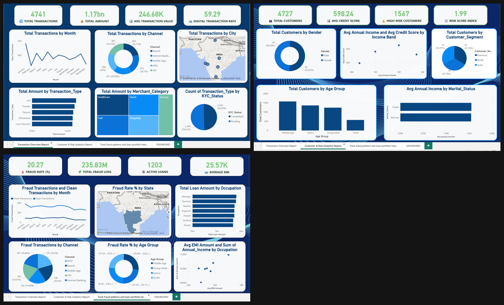

# 🏦 Bank Performance Dashboard

A multi-page Power BI report analyzing bank transactions, customer risk, and fraud/loan portfolio health.

## 🔑 Key Metrics

| Metric | Value |
|---|---|
| Total Assets | 1.17bn |
| Total Balance | 11.90bn |
| Total Customers | 4,727 |
| Fraud Rate | 20.27% |
| Active Loans | 1,203 |
| Avg Credit Score | 598.24 |

## 📈 What's Inside

A 4-page report — Transaction Overview, Customer & Risk Analytics, Fraud & Loan Portfolio Health, and a consolidated Dashboard — filterable by Year, Transaction Type, and Customer Segment.

*Transaction Overview • Customer & Risk Analytics • Fraud & Loan Portfolio Health*

## 💡 Key Insights

- Fraud is highest on digital channels.
- High-risk customers with pending KYC are the biggest red flag.
- Premium customers drive 78% of digital banking adoption.

## 🛠️ Tools Used

Power BI (DAX, geo mapping, cross-filtering, multi-page reports)

## 📂 Files

- `Bank_Performance_Dashboard.pbix` – full Power BI file
- `dashboard_preview.png` – main dashboard
- `additional_report_pages.png` – other report pages

## 👤 Author

**Faizan Rayeen**
