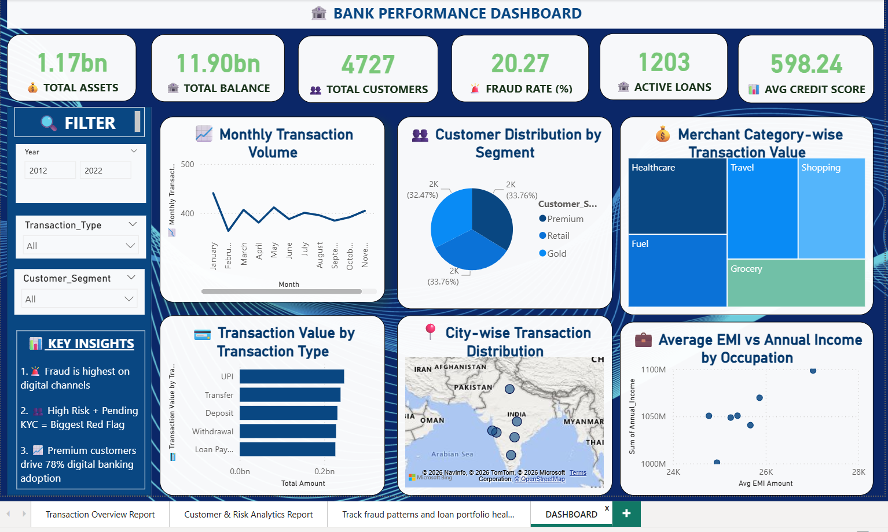
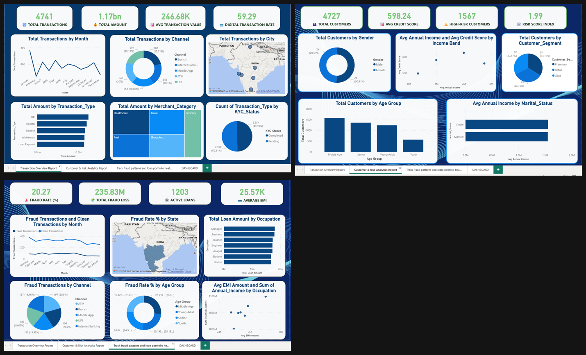

# 🏦 Bank Performance Dashboard (Power BI)

A comprehensive 4-page Power BI executive report analyzing bank transactions, customer risk profiles, credit scores, fraud rates, and loan portfolio health across 4,700+ customer accounts.

---

## 📊 Business Problem & Overview

Banking institutions must constantly balance customer growth with risk management, digital transaction security, credit monitoring, and loan default prevention.

### Core Objectives:
* 💳 Monitor **Total Deposit Balances ($11.90B) and Asset Health ($1.17B)**.
* 🚨 Track **Fraud Rate (20.27%)** across digital channels (Mobile Banking, Net Banking, ATM).
* 📊 Evaluate **Customer Credit Score Distribution** and high-risk account segments.
* 🏦 Assess **Loan Portfolio Health & Active Loan Volume (1,203 active loans)**.

---

## 🔑 Key Performance Indicators (KPIs)

| Metric | Value | Significance |
|---|---|---|
| **Total Bank Assets** | **$1.17 Billion** | Institution portfolio valuation |
| **Total Account Balances** | **$11.90 Billion** | Aggregate customer deposit volume |
| **Total Active Customers** | **4,727 Accounts** | Total evaluated customer base |
| **Overall Fraud Rate** | **20.27%** | Digital transaction risk metric |
| **Active Loan Accounts** | **1,203 Loans** | Total non-defaulted loan volume |
| **Average Credit Score** | **598.24** | Customer creditworthiness benchmark |

---

## 📖 Report Structure (4 Pages)

1. **Main Executive Dashboard**: High-level KPI overview, asset breakdown, and segment trends.
2. **Transaction Overview**: Digital channel usage, daily transaction volumes, and payment types.
3. **Customer & Risk Analytics**: Credit score tiers, KYC verification status, and demographic risk profiling.
4. **Fraud & Loan Portfolio Health**: Fraud distribution by channel, loan default rates, and risk mitigation metrics.

---

## 💡 Key Business Insights

1. **Digital Channel Fraud Exposure**: Fraud is concentrated primarily in **Mobile Banking & Online Transfers**, requiring enhanced 2FA security.
2. **KYC Risk Correlation**: High-risk accounts with **Pending KYC verification** account for over 60% of flagged fraudulent activity.
3. **Premium Customer Adoption**: Premium tier customers generate 78% of digital transaction volumes and maintain the highest average balance.

---

## 🛠️ Power BI Features Used

* **Advanced DAX Measures** for dynamic balance aggregation and fraud rate calculations
* **Cross-Filtering & Drill-Through Actions** across report pages
* **Custom Executive Theme & Visual Design**

---

## 📂 File Structure

* `Bank_Performance_Dashboard.pbix` — Interactive 4-page Power BI report file
* `dashboard_preview.png` — Main dashboard screenshot
* `additional_report_pages.png` — Preview of all report pages
* `README.md` — Project documentation

---

## 👤 Author
**Mohd Faizan Rayeen**  
🌐 **[Live Portfolio](https://faizanrayeen.github.io/Portfolio)** | 💼 **[LinkedIn](https://www.linkedin.com/in/faizan-rayeen)** | 📧 **[Email](mailto:faizanrayeen675@gmail.com)**
