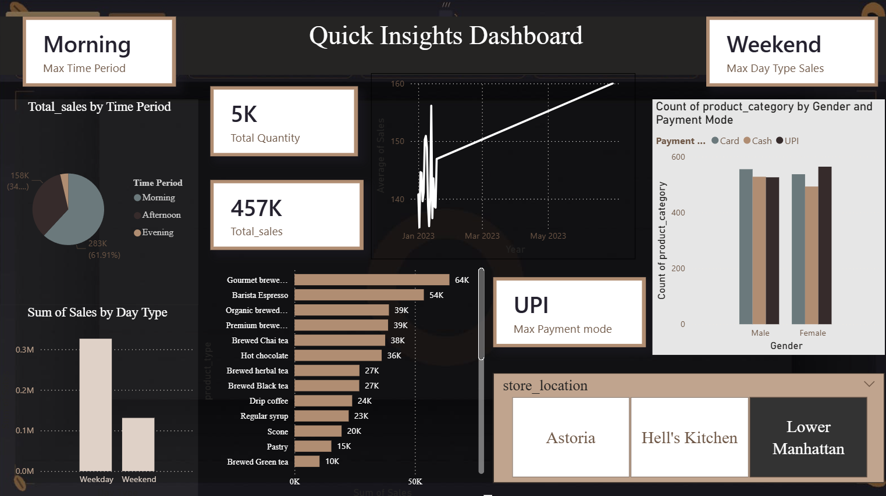
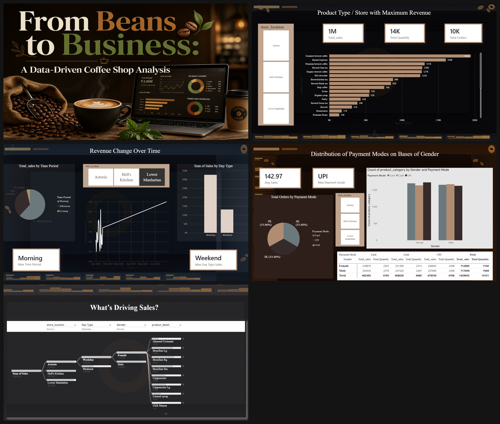

# ☕ From Beans to Business: A Data-Driven Coffee Shop Analysis

A multi-page Power BI report analyzing coffee shop sales, revenue drivers, and customer behavior across store locations.

*Quick Insights Dashboard*

## 🔑 Key Metrics

| Metric | Value |
|---|---|
| Total Sales | 1M+ |
| Total Quantity | 14K |
| Total Orders | 10K |
| Average Sales | 142.97 |
| Top Payment Mode | UPI |

## 📈 What's Inside

A 5-page report — Product/Store Revenue, Revenue Trends Over Time, Payment Modes by Gender, a "What's Driving Sales?" decomposition tree, and a Quick Insights summary — filterable by Store Location, Day Type, and Gender.

*Cover • Product/Store Revenue • Revenue Trends • Payment Modes • Sales Driver Tree*

## 💡 Key Insights

- Mornings drive 61.91% of total sales.
- Weekday sales significantly outperform weekends.
- Gourmet Brewed Coffee, Barista Espresso & Premium Brewed Coffee are top revenue drivers.
- UPI is the most preferred payment mode.

## 🛠️ Tools Used

Power BI (Decomposition Tree, DAX, multi-page reports, cross-filtering)

## 📂 Files

- `Data_Driven_Coffee_Shop_Analysis.pbix` – full Power BI file
- `dashboard_preview.png` – main dashboard
- `additional_report_pages.png` – other report pages

## 👤 Author

**Faizan Rayeen**
