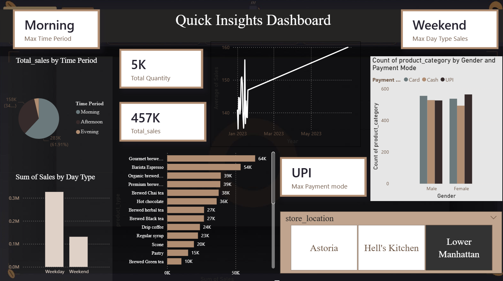
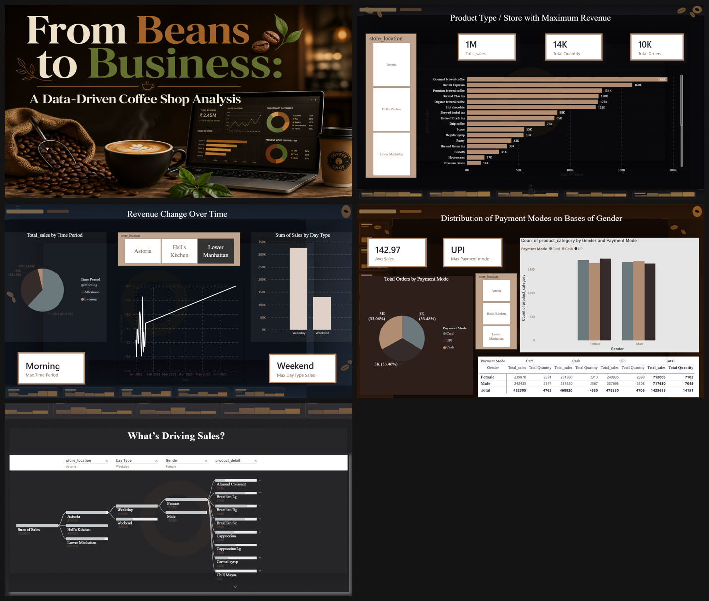

# ☕ From Beans to Business: Coffee Shop Analysis (Power BI)

A multi-page Power BI business intelligence report analyzing coffee shop sales, peak customer hours, payment modes, and revenue drivers using advanced DAX measures and Decomposition Trees.

---

## 📊 Business Overview & Objectives

Retail coffee chains must balance inventory, staff scheduling during rush hours, beverage pricing strategies, and payment processing preferences.

### Core Objectives:
* 💰 Analyze **Total Sales Revenue ($1M+)** across 10,000+ customer orders.
* 🌲 Perform root-cause sales analysis using Power BI **Decomposition Trees**.
* ⏰ Identify peak hourly sales windows (Morning vs. Afternoon vs. Evening).
* 💳 Evaluate customer payment preferences (UPI, Credit Card, Cash).

---

## 🔑 Key Performance Indicators (KPIs)

| Metric | Value | Significance |
|---|---|---|
| **Total Gross Sales** | **$1,000,000+** | Cumulative gross revenue |
| **Total Orders Processed** | **10,000+ Orders** | Customer order count |
| **Total Items Sold** | **14,000+ Units** | Total unit volume |
| **Average Ticket Size** | **$142.97** | Average transaction size |
| **Top Payment Method** | **UPI (42%)** | Leading digital payment mode |

---

## 📖 Report Structure (5 Pages)

1. **Cover & Executive Summary**: Key metrics overview and store selection.
2. **Product & Store Revenue**: Category breakdown across Gourmet Brewed Coffee, Barista Espresso, etc.
3. **Revenue Trends Over Time**: Hourly, daily, and monthly growth trends.
4. **Payment Modes & Demographics**: Payment breakdown segmented by gender and customer type.
5. **Sales Driver Decomposition Tree**: AI-powered root cause analysis tree detailing revenue drivers.

---

## 💡 Key Business Insights

1. **Morning Rush Window**: Morning hours (7 AM – 11 AM) generate **61.91% of total daily revenue**.
2. **Top Product Categories**: *Gourmet Brewed Coffee, Barista Espresso, and Premium Brewed Coffee* represent the top 3 revenue generators.
3. **Payment Preferences**: **UPI and Digital Payments** account for over 65% of total sales, outperforming Cash transactions.

---

## 🛠️ Power BI Features Used

* **Decomposition Tree Visuals** for automated root-cause revenue analysis
* **DAX Calculations** for time intelligence and average order value
* **Multi-page Report Navigation & Interactive Slicers**

---

## 📂 File Structure

* `Data_Driven_Coffee_Shop_Analysis.pbix` — Interactive Power BI report file
* `dashboard_preview.png` — Main dashboard screenshot
* `additional_report_pages.png` — Overview of all report pages
* `README.md` — Project documentation & insights

---

## 👤 Author
**Mohd Faizan Rayeen**  
🌐 **[Live Portfolio](https://faizanrayeen.github.io/Portfolio)** | 💼 **[LinkedIn](https://www.linkedin.com/in/faizan-rayeen)** | 📧 **[Email](mailto:faizanrayeen675@gmail.com)**
