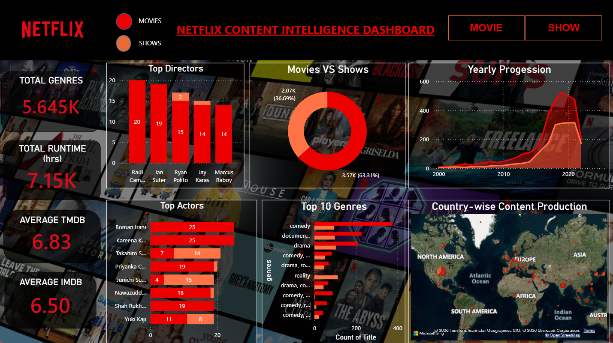

# 🎬 Netflix Content Intelligence Dashboard

A Power BI dashboard analyzing Netflix's content catalog — genres, directors, actors, ratings, and global content production trends.

## 📊 Overview

An interactive single-page dashboard that explores Netflix's Movies and Shows catalog, with slicers to filter between **Movie** and **Show** content types.

## 🔑 Key Metrics (KPIs)

| Metric | Value |
|---|---|
| Total Genres | 5.645K |
| Total Runtime | 7.15K hrs |
| Average TMDB Rating | 6.83 |
| Average IMDB Rating | 6.50 |

## 📈 Dashboard Components

- **Top Directors** – bar chart ranking directors by number of titles
- **Movies vs Shows** – donut chart showing content type split (63.31% Movies, 36.69% Shows)
- **Yearly Progression** – area chart tracking content release growth from 2000 to 2020+
- **Top Actors** – bar chart of most-featured actors across titles
- **Top 10 Genres** – horizontal bar chart ranking genres by title count
- **Country-wise Content Production** – geo map showing global content production hotspots
- **Interactive Filters** – toggle between Movie / Show content types

## 💡 Key Insights

- Movies significantly outnumber Shows in the catalog (63% vs 37%).
- Content production shows explosive growth starting around 2015, peaking near 2020.
- A small group of directors and actors account for a disproportionately large share of titles.
- Comedy and documentary are among the most common genres in the catalog.

## 🛠️ Tools Used

- Power BI (DAX measures, interactive slicers, geo mapping, custom theming)

## 📂 Files

- `Netflix_Content_Intelligence_Dashboard.pbix` – full interactive Power BI file
- `dashboard_preview.png` – dashboard screenshot

## 👤 Author

**Faizan Rayeen**
