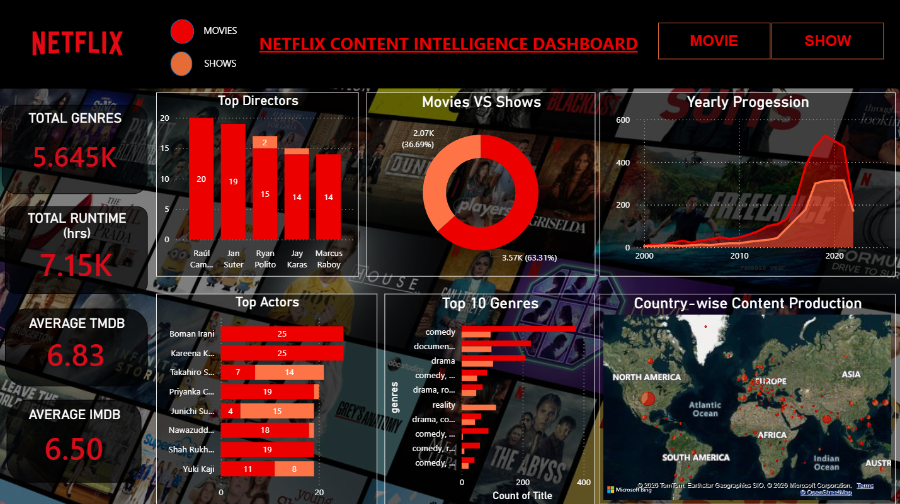

# 🎬 Netflix Content Intelligence Dashboard (Power BI)

An interactive Power BI dashboard analyzing Netflix's global content library—spanning movies, TV shows, genres, IMDb ratings, runtime, directors, and country production trends.

---

## 📊 Business Problem & Overview

Streaming platforms invest billions in original and licensed content. Understanding content growth velocity, genre demand, country distribution, and rating benchmarks is crucial for content acquisition strategy.

### Core Objectives:
* 🎬 Analyze ratio of **Movies vs. TV Shows** in the catalog.
* 📈 Measure content library growth progression over the years (1925–2021).
* 🌍 Map global content production across countries (USA, India, UK, etc.).
* 🌟 Benchmark catalog quality using **IMDb & TMDB score distributions**.

---

## 🔑 Key Performance Indicators (KPIs)

| Metric | Value | Significance |
|---|---|---|
| **Total Unique Genres Analyzed** | **5,645** | Multi-genre catalog tags evaluated |
| **Total Content Runtime** | **7,150+ Hours** | Cumulative library duration |
| **Average TMDB Rating** | **6.83 / 10** | High average audience satisfaction score |
| **Average IMDb Rating** | **6.50 / 10** | Global critic rating benchmark |
| **Movie Share** | **63.31%** | Dominant catalog content type |
| **TV Show Share** | **36.69%** | Fast-growing episodic content segment |

---

## 📈 Dashboard Highlights & DAX Measures

* **Movies vs. Shows Ratio**: Interactive visual detailing Movie majority (63.31%).
* **Yearly Content Progression**: Line chart demonstrating exponential content expansion post-2015.
* **Geographic Production Map**: Interactive map displaying USA and India as primary content production hubs.
* **Top Directors & Actors**: Leaderboards featuring top contributing directors (*Raúl Campos, Jan Suter*) and actors (*Boman Irani, Kareena Kapoor*).
* **Interactive Slicers**: Toggle filters between Movies, TV Shows, Genres, and Release Years.

---

## 💡 Key Business Insights

1. **Post-2015 Explosion**: Netflix's international expansion triggered a sharp increase in catalog additions after 2015.
2. **Genre Dominance**: **Comedy and Drama** represent the highest volume of catalog titles worldwide.
3. **Regional Heavyweights**: The **United States and India** lead global content production, followed by the United Kingdom and Japan.
4. **Director/Actor Concentration**: A core set of recurring directors and actors account for a significant portion of international titles.

---

## 🛠️ Power BI Features Used

* **DAX Calculations** for runtime aggregations and weighted rating averages
* **Interactive Slicers & Page Tooltips**
* **Geo Mapping & Custom Dark Theme Styling**

---

## 📂 File Structure

* `Netflix_Content_Intelligence_Dashboard.pbix` — Interactive Power BI report file
* `dashboard_preview.png` — High-resolution dashboard screenshot
* `README.md` — Project documentation & insights

---

## 👤 Author
**Mohd Faizan Rayeen**  
🌐 **[Live Portfolio](https://faizanrayeen.github.io/Portfolio)** | 💼 **[LinkedIn](https://www.linkedin.com/in/faizan-rayeen)** | 📧 **[Email](mailto:faizanrayeen675@gmail.com)**
