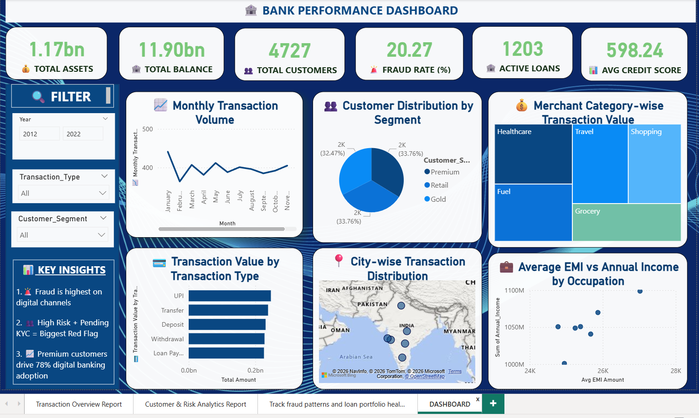
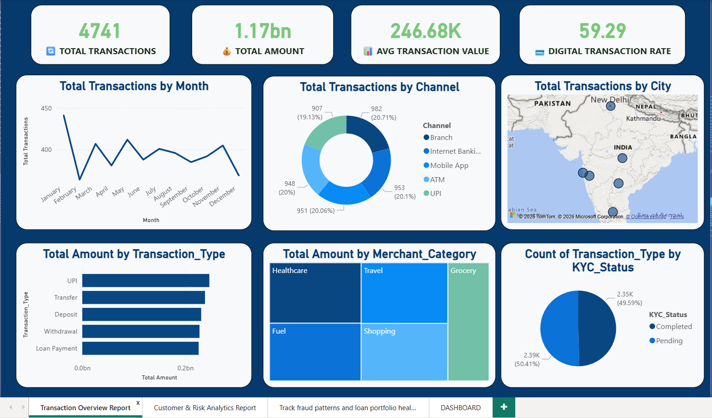
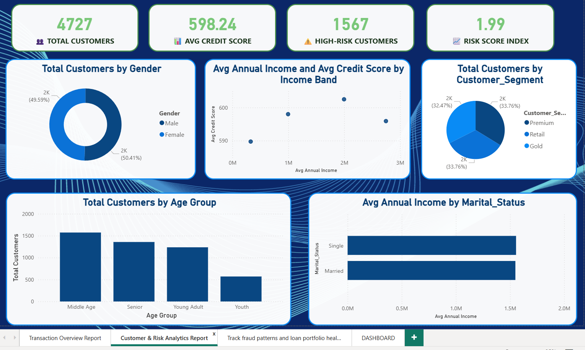
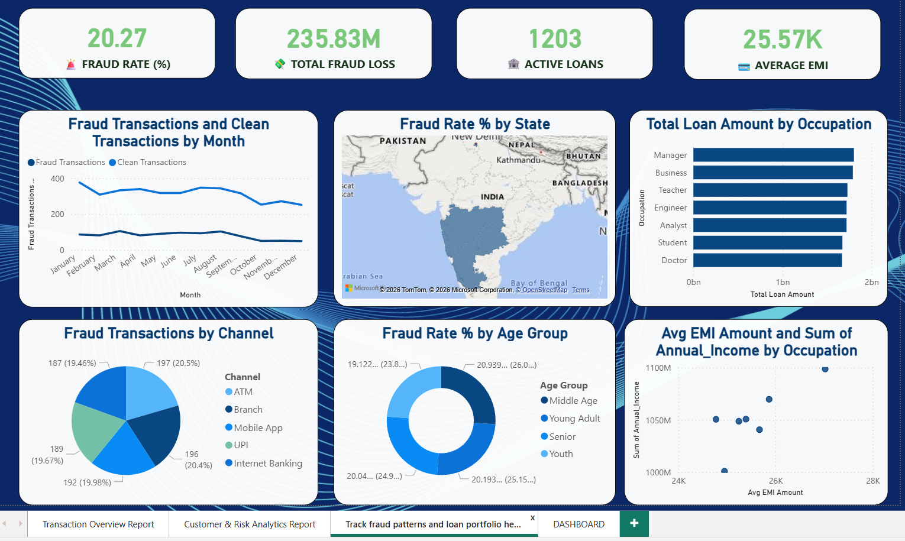

# 🏦 Bank Performance Dashboard

A multi-page Power BI report analyzing bank transactions, customer risk, and fraud/loan portfolio health — built to support banking operations and risk management decisions.

*Final consolidated dashboard summarizing all report pages*

## 📊 Overview

This is a 4-page Power BI report covering transactions, customer & risk analytics, fraud & loan health, and a final consolidated dashboard — filterable by **Year**, **Transaction Type**, and **Customer Segment**.

## 🔑 Key Metrics (KPIs)

| Metric | Value |
|---|---|
| Total Assets | 1.17bn |
| Total Balance | 11.90bn |
| Total Customers | 4,727 |
| Fraud Rate | 20.27% |
| Active Loans | 1,203 |
| Average Credit Score | 598.24 |

## 📈 Report Pages

### 1️⃣ Transaction Overview Report

- Total Transactions, Total Amount, Avg Transaction Value, Digital Transaction Rate
- Transactions by Month, Channel (Branch/Internet/Mobile/ATM/UPI), and City
- Transaction Amount by Type and Merchant Category
- KYC Status distribution

### 2️⃣ Customer & Risk Analytics Report

- Total Customers, Avg Credit Score, High-Risk Customers, Risk Score Index
- Customer distribution by Gender, Segment (Premium/Retail/Gold), and Age Group
- Avg Annual Income vs Credit Score by Income Band
- Avg Annual Income by Marital Status

### 3️⃣ Fraud & Loan Portfolio Health Report

- Fraud Rate %, Total Fraud Loss, Active Loans, Average EMI
- Fraud vs Clean Transactions trend by month
- Fraud Rate % by State (geo map) and Age Group
- Loan Amount by Occupation

### 4️⃣ Consolidated Dashboard (Main Summary)

- Combined view of all key metrics across transactions, customers, and risk
- Interactive filters for Year, Transaction Type, and Customer Segment

## 💡 Key Insights

- Fraud is highest on digital channels.
- High-risk customers combined with pending KYC status represent the biggest red flag.
- Premium customers drive 78% of digital banking adoption.

## 🛠️ Tools Used

- Power BI (multi-page reports, DAX measures, geo mapping, cross-filtering, custom theming)

## 📂 Files

- `Bank_Performance_Dashboard.pbix` – full interactive Power BI file
- `dashboard_preview.png` – main consolidated dashboard screenshot
- `transaction_overview_report.png`, `customer_risk_analytics_report.png`, `fraud_loan_portfolio_report.png` – individual report page screenshots

## 👤 Author

**Faizan Rayeen**
