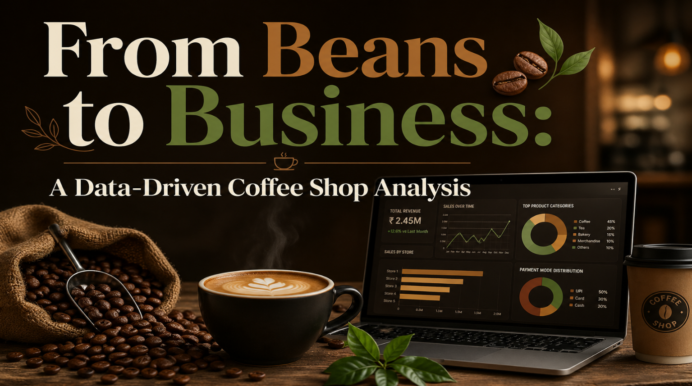
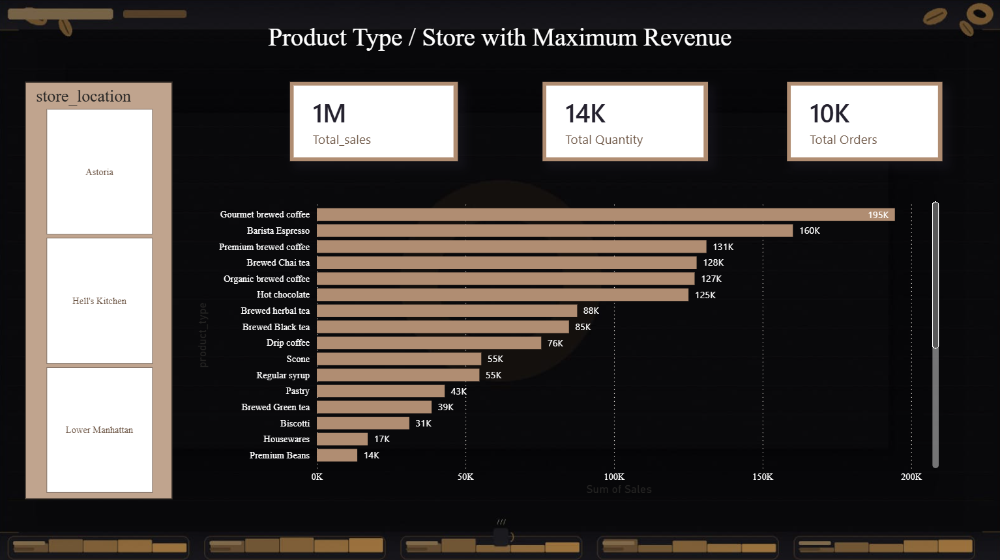
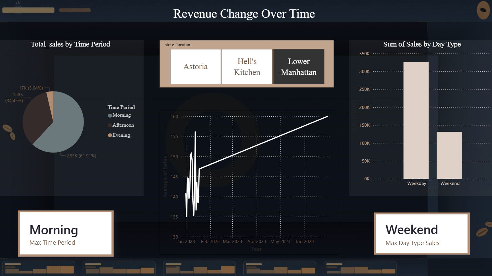
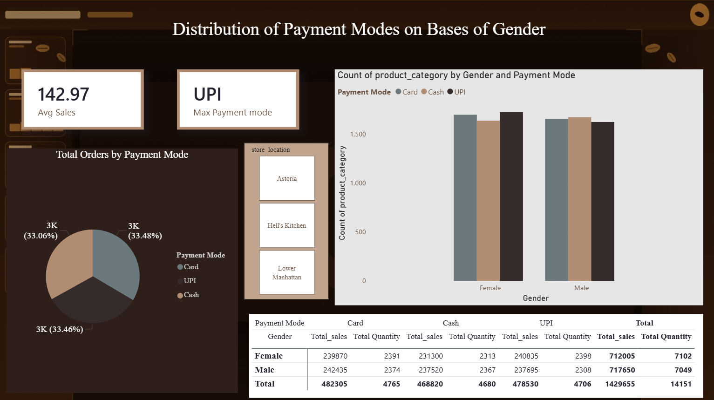
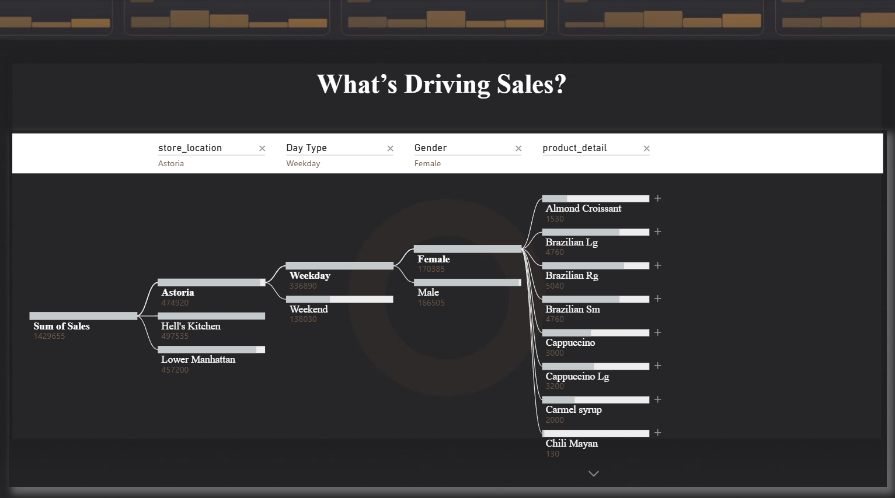

# ☕ From Beans to Business: A Data-Driven Coffee Shop Analysis

A multi-page Power BI report analyzing coffee shop sales, revenue drivers, and customer behavior across store locations — built to uncover what's really driving sales.

*Quick Insights Dashboard — final consolidated summary*

## 📊 Overview

This is a 5-page Power BI report (plus a cover page) covering product/store revenue, revenue trends over time, payment behavior by gender, and a "What's Driving Sales?" decomposition tree — filterable by **Store Location**, **Day Type**, and **Gender**.

## 🔑 Key Metrics (KPIs)

| Metric | Value |
|---|---|
| Total Sales | 1M+ |
| Total Quantity | 14K |
| Total Orders | 10K |
| Average Sales | 142.97 |
| Max Payment Mode | UPI |

## 📈 Report Pages

### Cover Page

### 1️⃣ Product Type / Store with Maximum Revenue

- Ranked bar chart of product types by total sales (Gourmet Brewed Coffee leads at 195K)
- Filterable by store location (Astoria, Hell's Kitchen, Lower Manhattan)

### 2️⃣ Revenue Change Over Time

- Total Sales by Time Period (Morning/Afternoon/Evening) — Morning dominates at 61.91%
- Weekday vs Weekend sales comparison
- Average Sales trend across months

### 3️⃣ Distribution of Payment Modes by Gender

- Total Orders by Payment Mode (Card/UPI/Cash — nearly even split)
- Product category count by Gender and Payment Mode
- Detailed sales & quantity breakdown table by Gender and Payment Mode

### 4️⃣ What's Driving Sales? (Decomposition Tree)

- Interactive drill-down from Store Location → Day Type → Gender → Product Detail
- Enables root-cause analysis of sales drivers

### 5️⃣ Quick Insights Dashboard (Main Summary)

- Consolidated view combining time period, product performance, payment mode, and store filters

## 💡 Key Insights

- Mornings drive the majority of sales (61.91%) compared to Afternoon and Evening.
- Weekday sales significantly outperform Weekend sales.
- Gourmet Brewed Coffee, Barista Espresso, and Premium Brewed Coffee are the top revenue-generating products.
- UPI is the most preferred payment mode, followed closely by Card and Cash.

## 🛠️ Tools Used

- Power BI (Decomposition Tree, DAX measures, multi-page reports, cross-filtering, custom theming)

## 📂 Files

- `Data_Driven_Coffee_Shop_Analysis.pbix` – full interactive Power BI file
- `dashboard_preview.png` – main Quick Insights dashboard screenshot
- `cover_page.png`, `product_store_revenue.png`, `revenue_change_over_time.png`, `payment_modes_by_gender.png`, `whats_driving_sales.png` – individual report page screenshots

## 👤 Author

**Faizan Rayeen**
