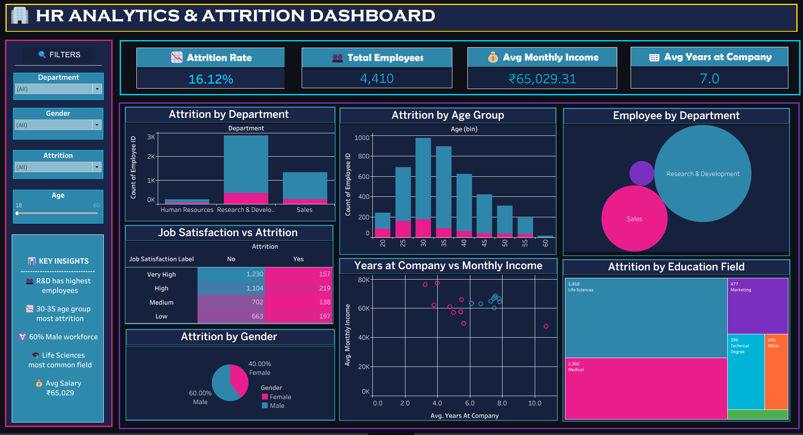

# 👥 HR Analytics & Attrition Dashboard

A Tableau dashboard analyzing employee attrition patterns across departments, age groups, and job satisfaction levels — built to support HR retention strategy.

## 🔑 Key Metrics

| Metric | Value |
|---|---|
| Attrition Rate | 16.12% |
| Total Employees | 4,410 |
| Avg Monthly Income | ₹65,029.31 |
| Avg Years at Company | 7.0 |

## 📈 What's Inside

- Attrition by Department, Age Group, and Gender
- Job Satisfaction vs Attrition breakdown
- Years at Company vs Monthly Income scatter plot
- Employee distribution by Department (packed bubble chart)
- Attrition by Education Field
- Interactive filters — Department, Gender, Attrition, Age range

## 💡 Key Insights

- Research & Development has the highest employee count.
- The 30–35 age group shows the most attrition.
- Workforce is 60% male.
- Life Sciences is the most common education field.
- Average salary stands at ₹65,029.

## 🛠️ Tools Used

Tableau (calculated fields, dashboard actions, interactive filters)

## 📂 Files

- `HR_Analytics_Attrition_Dashboard.twbx` – packaged Tableau workbook (includes data)
- `dashboard_preview.png` – dashboard screenshot

## 👤 Author

**Faizan Rayeen**
