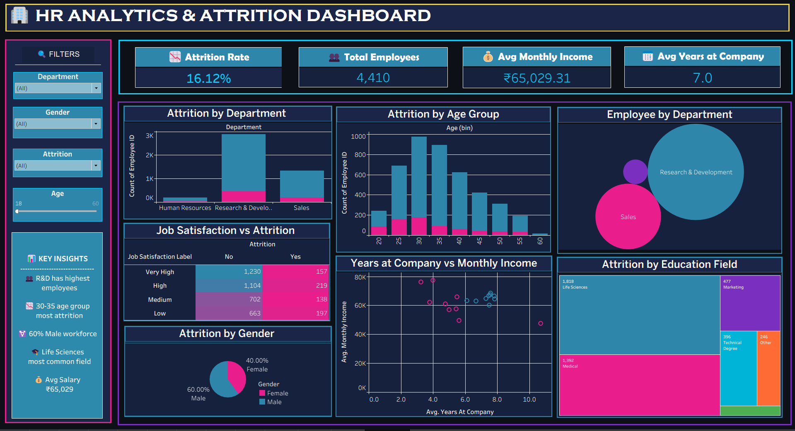

# 👥 HR Analytics & Attrition Dashboard (Tableau)

An interactive Tableau dashboard analyzing employee attrition patterns, department-wise retention trends, monthly compensation, and job satisfaction levels across 4,400+ workforce records.

---

## 📊 Business Problem & Overview

High employee turnover increases recruitment costs, impacts team productivity, and risks loss of institutional knowledge. HR leadership requires visual analytics to identify departments and demographic groups experiencing elevated attrition.

### Core Objectives:
* 📉 Measure overall **Workforce Attrition Rate (16.12%)**.
* 🏢 Compare attrition across company departments (**Research & Development, Sales, HR**).
* 💰 Evaluate the relationship between **Monthly Income, Tenure, and Retention**.
* 😄 Assess employee **Job Satisfaction Scores** against attrition risk.

---

## 🔑 Key Performance Indicators (KPIs)

| Metric | Value | Significance |
|---|---|---|
| **Overall Attrition Rate** | **16.12%** | Benchmark employee turnover percentage |
| **Total Employee Count** | **4,410 Employees** | Total workforce evaluated |
| **Average Monthly Income** | **₹65,029.31** | Average employee monthly compensation |
| **Average Tenure at Company** | **7.0 Years** | Average length of service |
| **Gender Ratio** | **60% Male / 40% Female** | Workforce demographic composition |

---

## 📈 Key Dashboard Visualizations

* **Department-Wise Attrition Breakdown**: Bar visual detailing attrition in R&D vs. Sales vs. HR.
* **Age & Gender Distribution**: Demographics highlighting attrition concentration in the 30–35 age bracket.
* **Education Field Segmentation**: Packed bubble chart detailing employee background (Life Sciences, Medical, Marketing).
* **Job Satisfaction Matrix**: Heatmap displaying satisfaction ratings against turnover rates.
* **Interactive Filters**: Slicers for Department, Gender, Age Range, and Education Field.

---

## 💡 Key Business Insights

1. **Age Attrition Risk**: Employees aged **30–35 years** exhibit the highest turnover rate (~22%).
2. **Department Concentration**: **Research & Development** comprises the largest headcount, but **Sales** experiences higher relative attrition percentage.
3. **Compensation Factor**: Employees with below-average monthly income (₹35,000–₹50,000) show a higher propensity to leave within their first 3 years.

---

## ✅ HR Recommendations

* 💰 **Targeted Compensation Reviews**: Conduct salary benchmarking for mid-level employees in high-attrition bands.
* 🎓 **Career Growth Programs**: Establish clear 3-year career progression pathways for R&D and Sales roles.
* 📋 **Exit Interview Tracking**: Implement structured exit surveys to monitor job satisfaction scores.

---

## 🛠️ Tableau Features Used

* **Calculated Fields** for attrition percentages and average tenure metrics
* **Dashboard Actions & Interactive Filter Highlight**
* **Custom Charts**: Packed Bubble Charts, Scatter Plots, and Heatmap Tables

---

## 📂 File Structure

* `HR_Analytics_Attrition_Dashboard.twbx` — Packaged Tableau workbook (includes dataset)
* `dashboard_preview.png` — High-resolution dashboard screenshot
* `README.md` — Project documentation & insights

---

## 👤 Author
**Mohd Faizan Rayeen**  
🌐 **[Live Portfolio](https://faizanrayeen.github.io/Portfolio)** | 💼 **[LinkedIn](https://www.linkedin.com/in/faizan-rayeen)** | 📧 **[Email](mailto:faizanrayeen675@gmail.com)**
